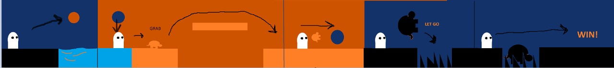

# TimeAfterTime
Proyecto Final de la materia "Gráficas Computacionales" TC3022 
 
<h1>Descripción</h1>
Creamos un videojuego llamado Time After Time. Este juego es un 2.5 D sidescroller de puzzles y plataformas en el que el objetivo es completar todos los niveles para llegar al final del juego. Para resolver los puzzles el jugador tendrá que usar portales posicionados en distintas partes del mapas y, así, lograr completar las distintas secciones del juego. 
 
<h1>Requerimientos del proyecto</h1>
<ul>
    <li>Librerías: 
        <ul>
            <li>three.js</li>
            <li>cannon.js</li>
            <li>tween.js</li>   
            <li>keyframe.js</li>
        </ul>
    </li>
    <li>Utilizar luces y sombras, materiales y animaciones los objetos que lo requieran. Las luz vendrá de luces direccionales que proyectarán sombras de objetos en el suelo al usar los respectivos constructores de three js. Las animaciones serán usadas para hacer que un objeto camine al combinar el uso de tween js con keyframe js. </li>
    <li>Se deben incluir carga de modelos en 3D para algunos objetos. Con los mismos loaders de three js, los modelos cargados serán .obj y .mtl.</li>
    <li>El juego debe tener un principio y fin, por lo que debe haber una manera de ganar y un flujo a seguir.</li>
    <li>Agregar controles básicos para que el jugador pueda mover al personaje principal.  </li>
    <li>Utilizar una cámara que siga al jugador horizontalmente para que el juego tenga aspecto de side scroller. La cámara tendrá la misma posición en x. </li>
    <li>Crear mecánica para que el jugador pueda empujar objetos. Vamos a cargar todo un world con cannon js para detectar colisiones entre los renders de three js. </li>
    <li>Crear mecánica para “saltar” en el tiempo. Es decir, transportar al fantasma a otro escenario previamente cargado vía sus coordenadas en x, y, z. </li>
    <li>Crear una interfaz de usuario al inicio del juego que sirva como menú inicial. Cargar un canvas en html y css. </li>
    <li>Crear una pantalla de Game Over, en caso de que el jugador pierda o de que el jugador gane. Cargar un canvas en html y css. </li>
    <li>El juego deberá contar con dos secciones, cada una con tres retos  diferentes:
        <ul>
            <li>Nivel 1: 1) saltar, sin caer al agua, al portal y aterrizar en hielo en el segundo escenario; 2) saltar con la tortuga las plataformas  hacia el segundo portal; 3) subirse en la tortuga para pasar los picos.</li>
            <li>Nivel 2: 1) saltar hacia el portal sin tocar la lava; 2) saltar hacia el segundo portal que se mueve; 3) evitar fantasmas rojos y llegar al último portal para ganar.</li>
        </ul> 
    </li>
</ul>
 
<h1>Diseño de mapas</h1>
<h3>Nivel 1</h3>
  

 La idea de este primer nivel es que el jugador pueda usar los portales para cambiar entre dos dimensiones y poder cruzar los obstáculos en el camino. El jugador no podrá caminar o nadar en el agua por lo que tendrá que ir al pasado donde el agua estará congelada. Ahí encontará una rana la cual le será de utilidad más adelante, ya que tendrá que brincar unos picos los cuales no podrá pasar con un simple salto. Al ir al futuro la rana crece de tamaño, esto le permitirá utilizarla para utilizarla como plataforma y así brincar para llegar al último portal y cruzar al segundo nivel.
<h3>Nivel 2</h3>
  
En el segundo nivel lo naranja representa lava que el jugador no puede tocar, si lo hace morirá. Tendrá que brincar a través de las plataformas hasta alcanzar los portales. El primer portal lo lleva al futuro donde la lava está congelada. En esa dimensión se enonctrará con fantasmas enemigos que tendrá que esquivar y llegar al portal que lo regresará al pasado. Este lo llevará a la parte de en medio donde habrá un portal con movimiento aleatorio. El jugador tendrá que alcanzarlo para cruzar a la última parte de la misma dimensión, pasar a la siguiente dimensión y finalmente terminar el juego.
